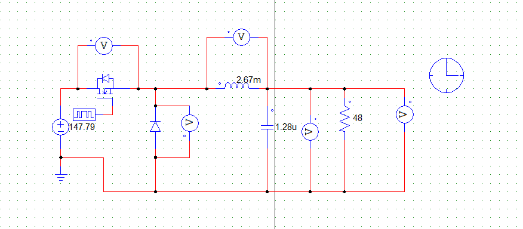

# Buck Converter Simulations

## Circuit

The simulation was performed for the minimum input voltage specified. The component values calculated were based on theoretical calculations. 

## Load Ro
### Vo

### Io

## Inductor Lo
### VLo

### ILo

## Capacitor Co
### VCo

### Io

## Mosfet
### Vmosf

### Imosf

## Doide Do
### VDo

### IDo

