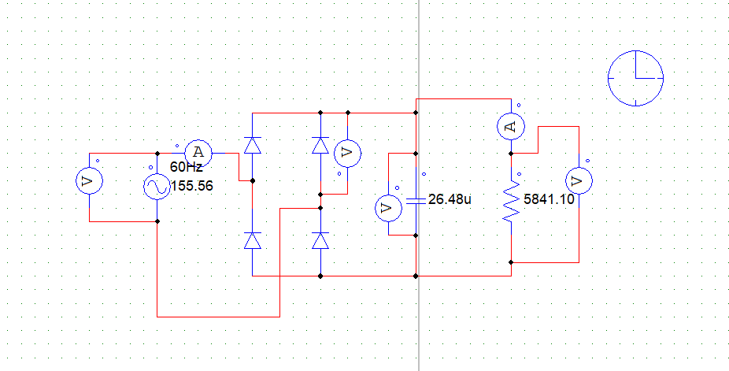
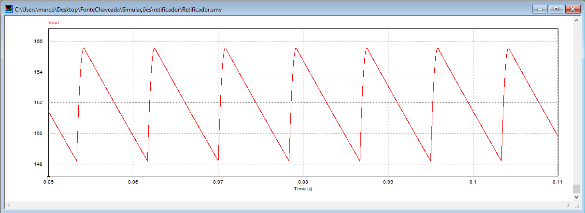
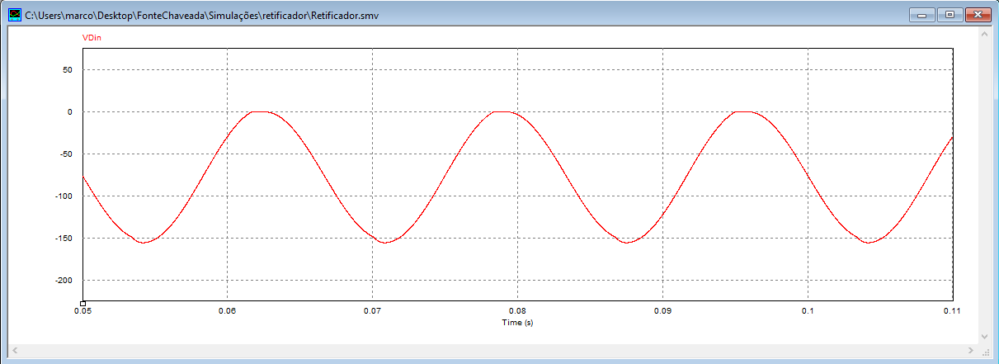
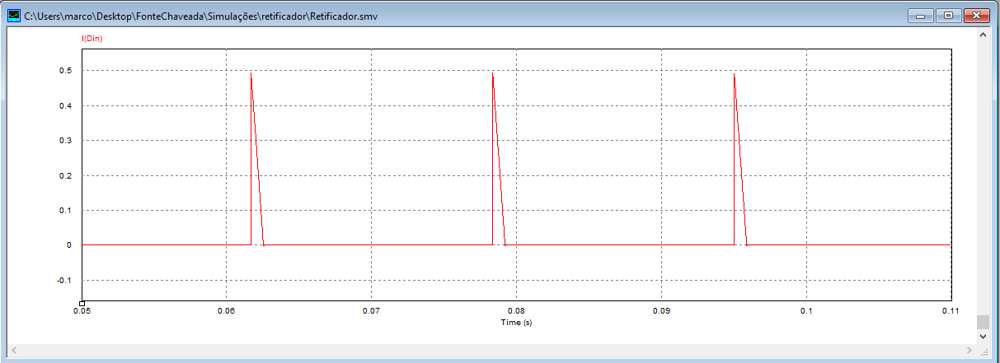
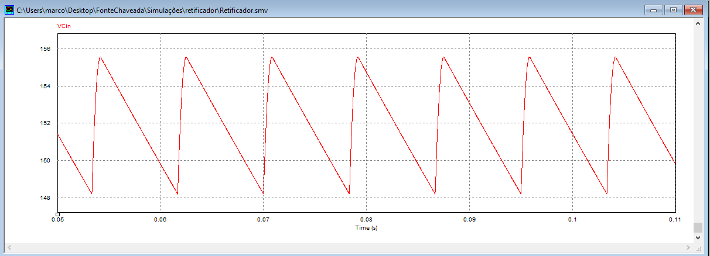
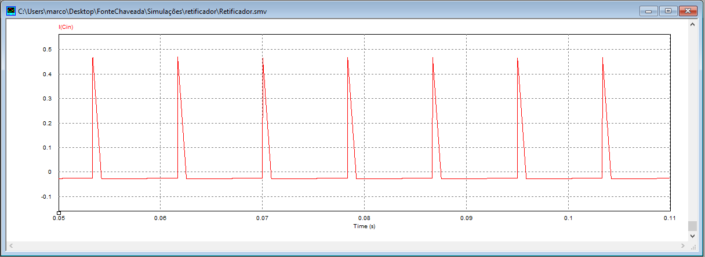
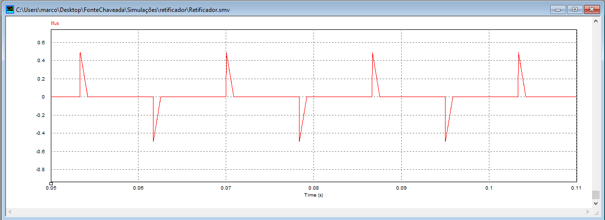

# Retifier Simulations

## Circuit

The simulation was performed for the minimum input voltage specified. The component values calculated were based on theoretical calculations.

## Output

### Vout

### Iout

## Diode Din

### VDin

### IDin

## Capacitor Cin

### VCin

### ICin

## Input

### Vin

### Iin

