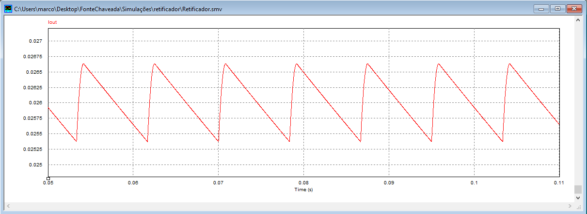
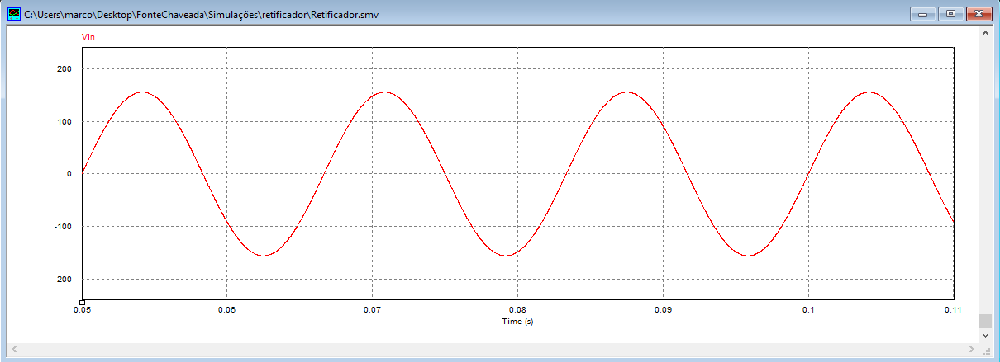

# Retifier Simulations

## Circuit

The simulation was performed for the minimum input voltage specified. The component values calculated were based on theoretical calculations. However, since components rarely come in exact values, the final simulation will display the components that will actually be used in the implementation.

## Output

### Vout

### Iout

## Diode Din

### VDin

### IDin

## Capacitor Cin

### VCin

### ICin

## Input

### Vin

### Iin

