# Switch Power Supply Circuit

## Circuit

For the switched-mode power supply circuit, commercial component values were used; therefore, the values differ from the simulations of the converter and the rectifier. Since the input voltage frequency is 60 Hz and the switching frequency is 66 kHz, it was challenging to choose a suitable time step to accurately visualize every part of the circuit. Therefore, for the rectifier, only the output voltage and current parameters will be included in this file.

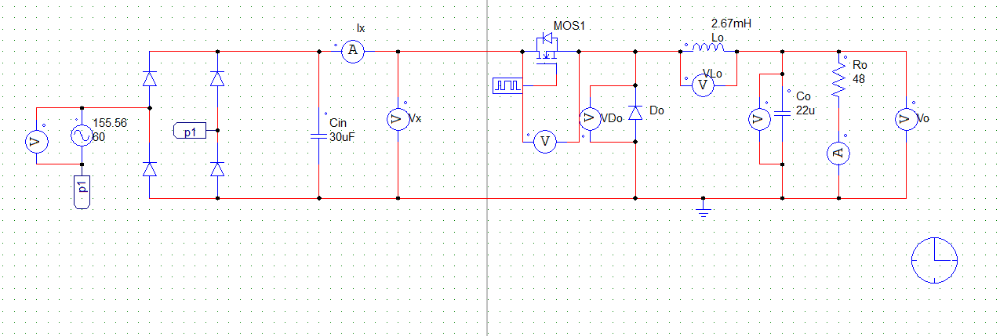

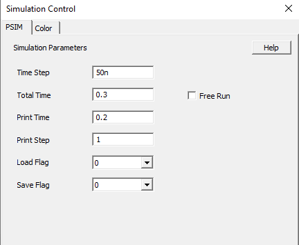

## Retifier Output
### Vx
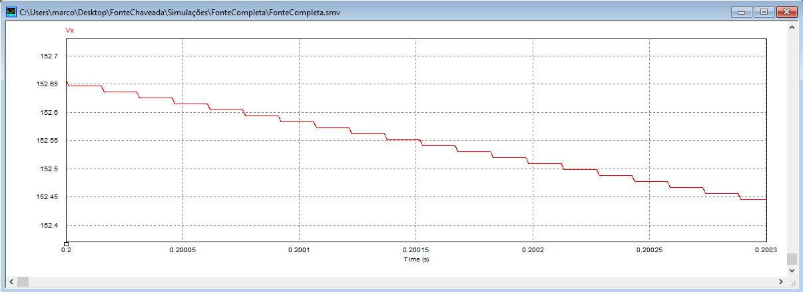
### Ix
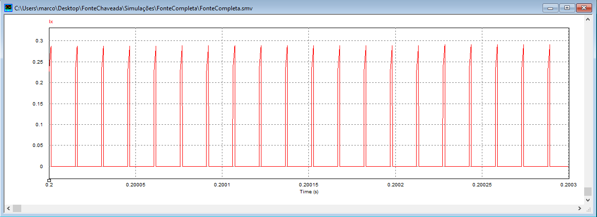

## Load Ro
### Vo
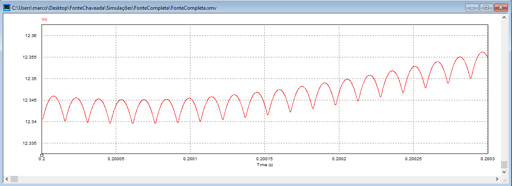
### Io
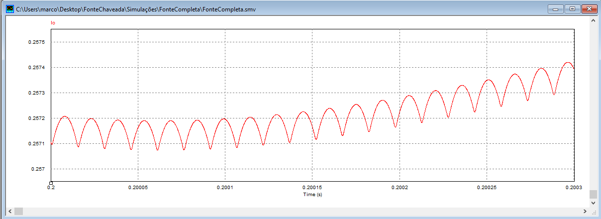

## Inductor Lo
### VLo
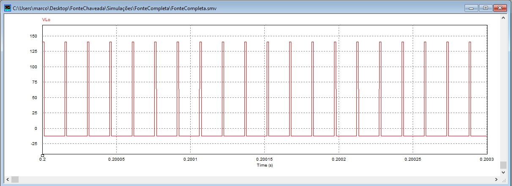
### ILo
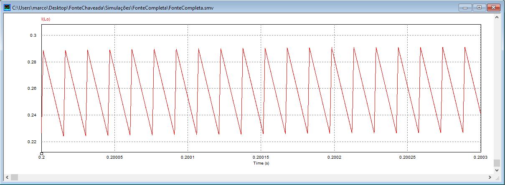

## Capacitor Co
### VCo

### ICo
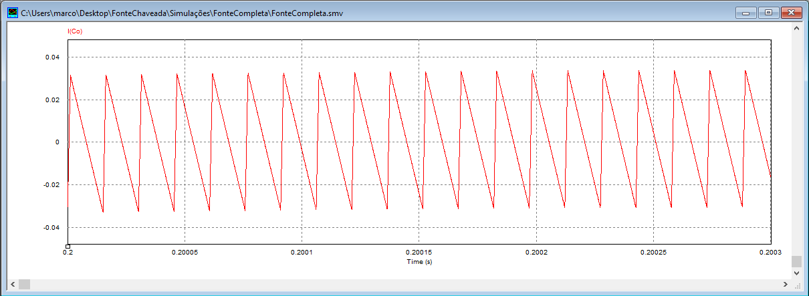

## Mosfet
### Vmosf
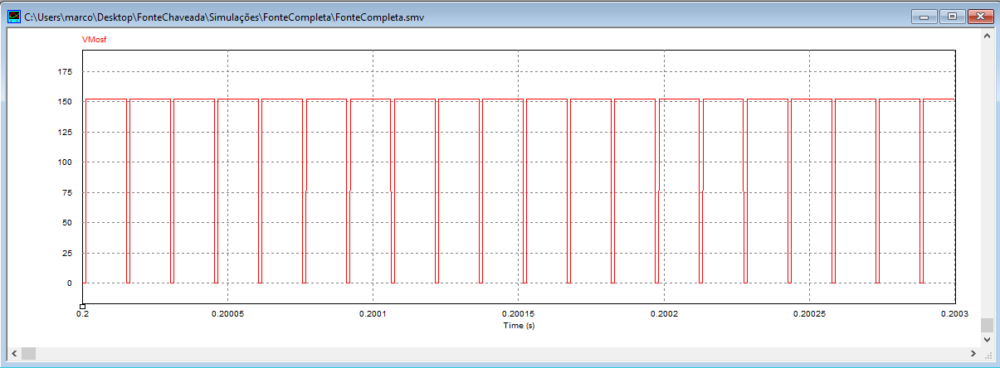
### Imosf
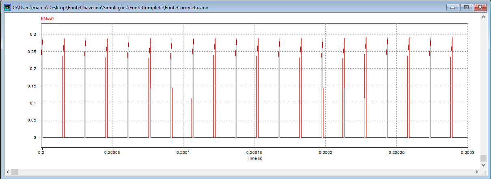

## Doide Do
### VDo

### IDo
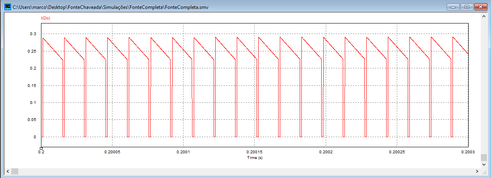

